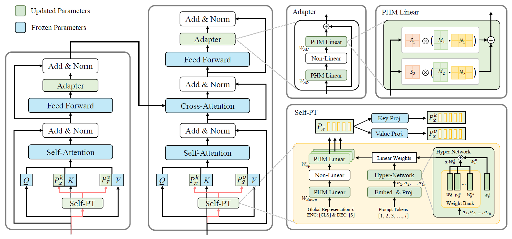

# Self-PT: Adaptive Self-Prompt Tuning for Low-Resource Visual Question Answering

Official code and models for the ACM MM 2023 paper: 

[**Self-PT: Adaptive Self-Prompt Tuning for Low-Resource Visual Question Answering**](https://doi.org/10.1145/3581783.3612222)

Bowen Yuan, Sisi You, Bing-Kun Bao*

ACM Multimedia 2023

**Self-PT** is a context-aware prompt tuning method for low-resource VQA, which can adapt large vision-language pretraining models to VQA tasks with only **~1M parameters** and **16 training samples**! If you have any questions, please feel free to raise an issue or email <yuanbw0925@gmail.com>.

Details can be found in https://github.com/NJUPT-MCC/Self-PT.


 

## Citation

If you find our work useful in your research, please consider citing:

```
@inproceedings{yuan2023self,
  title={Self-PT: Adaptive Self-Prompt Tuning for Low-Resource Visual Question Answering},
  author={Yuan, Bowen and You, Sisi and Bao, Bing-Kun},
  booktitle={Proceedings of the 31st ACM International Conference on Multimedia},
  pages={5089--5098},
  year={2023}
}
```
